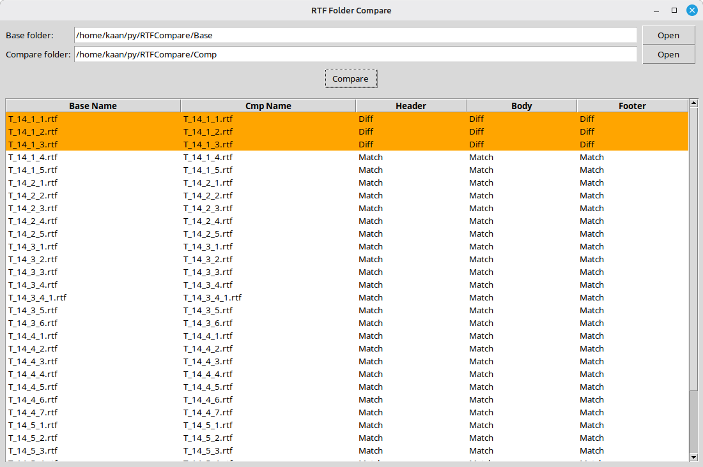
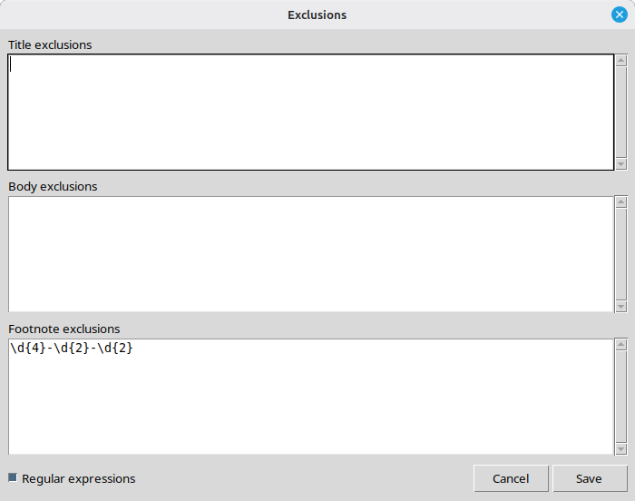
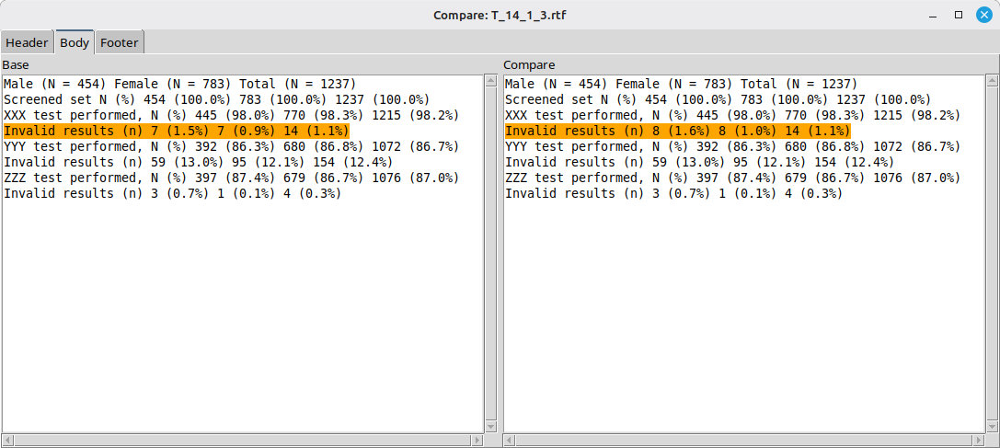
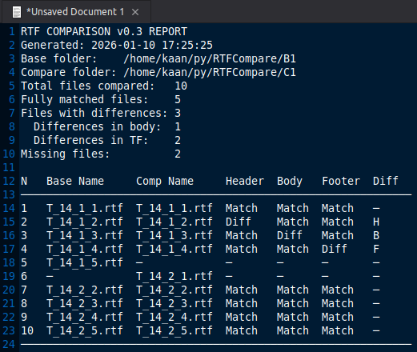
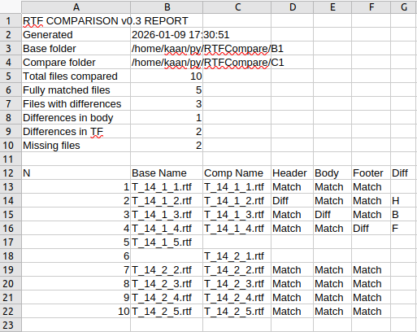

# RTFCompare
RTFCompare is an application that helps compare new RTF outputs with previous versions to identify differences.

It is a Python app compiled into single-file Windows 10\11 executable using Nuitka tool. No installation required, just copy to any convenient location and run.

The main window allows you to select two folders containing RTF files: one with older versions and one with newer versions. You can run the comparison, copy results to the clipboard, or clear the results area. The tool automatically pairs files by filename and analyzes each RTF document, extracting and comparing three sections: Header, Body, and Footer. User can specify exclusions - text markers (as case-sensitive text strings or as regular expressions) which will remove text strings with such markers from comparison. For example user can add exclusion for footnote which will remove text string with datetime stamp from comparison. Differences between versions are clearly displayed in a color-coded results table (Green - full match, Yellow - header or footer contains mismatches, Orange - body contains mismtaches, Gray - file is missing in base or comparison folder). Users can also use the main menu or hotkeys to select folders, save results to TXT or CSV files, run comparisons, and more.

There are two checkboxes available:
* **In-text titles and footnotes** – treats text appearing before or after the table structure on each page as titles and footnotes.
* **Indent columns** – adjusts the width of all columns in the identified table structure for better visual appearance in the side-by-side viewer.

Results can be sorted in ascending or descending order by any column.

For detailed analysis, double-click (or press **Enter**) on any file pair to open a side-by-side comparison window. This window features three tabs (Header, Body, Footer) showing extracted text from both versions, with differences highlighted in orange for easy identification. On startup, the window automatically opens the first tab that contains differences, if any.

---

Main window:

 

Exclusions window:

 

Side-by-side comparison:

 

Results copied to the clipboard or saved to TXT or CSV file:

  

---
```
MD5     06AE9599F138FE985369090910C7769A
SHA1    36337378E6F8A61C07677CD1CCF15868951E9E47
SHA256  2BEDB74B01E81FA085CF5D90AC26A2663DC7E4523356F9E8F7285A9419BEF979
```
<sub>VisrusTotal check results:</sub><br>
<sup>https://www.virustotal.com/gui/file/2bedb74b01e81fa085cf5d90ac26a2663dc7e4523356f9e8f7285a9419bef979</sup>

<sub>Kaspersky check results:</sub><br>
<sup>https://opentip.kaspersky.com/2BEDB74B01E81FA085CF5D90AC26A2663DC7E4523356F9E8F7285A9419BEF979</sup>
